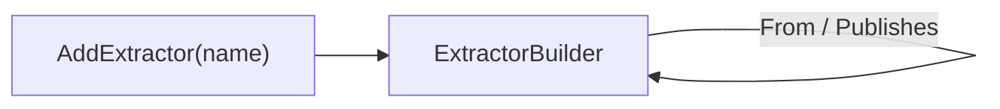

# Components

> Every component is declared through a block builder that exposes only its legal edges — illegal topology is a compile error.

## How it works



Each `Add*` call on `SystemBuilder` returns the block's builder directly, whose members are exactly that block's legal edges. A method that would be illegal for the block type does not exist on its builder type, so the compiler rejects it before validation ever runs. The topology records the edges *between* components plus one activation attribute: an optional cron schedule (`WithSchedule`, extractors only — see [ADR 0010](../decisions/0010-schedule-as-activation-attribute.md)). Everything else about the workload shape (hosting model, ports, process lifetime) lives in the component's own scaffold.

Underneath, every declaration is a **`Component`** — the shared substance each builder records into, mirroring `Pipeline`'s role in `intropy-framework`. Each block kind is a sealed subclass (`ExtractorComponent`, `LoaderComponent`, `TransactionalIntegrationComponent`), and the builder exposes it via its `Component` property:

```csharp
ExtractorComponent orders = s.AddExtractor("order-extractor")
    .From(Connectors.OrderExtractorSource)
    .Publishes(Topics.Orders)
    .Component;                       // optional typed handle — Name, Kind
```

Holding the handle is opt-in; chains that don't need it are unchanged. The component exposes `Name` and `Kind`; the recorded edges stay internal until `Build()` materializes them into the model.

## Component kinds

Each kind exposes only its own legal edges:

| Kind | Subscribes | Publishes | Connector | Required |
|------|-----------|-----------|-----------|----------|
| Extractor | — | one topic | `From(connector)` | `Publishes` |
| Loader | exactly 1 topic | — | `To(connector)` | `Subscribes` |
| Transactional integration | — | — | `From` / `To(connector)` | — |

`Subscribes`/`Publishes` are the asynchronous (topic) edges; `From`/`To` are the edges out through connectors. A component publishes at most one topic — a second `Publishes` call is ITP101 at `Build()`. See [Topics](topics.md) and [Connectors](connectors.md).

Only extractors additionally take `WithSchedule("<cron>")` — a run-to-completion extractor activated on a cron tick (five-field cron or a macro such as `@daily`; syntax is ITP210 at `Build()`). Without a schedule a component runs once at host start.

## Declaring components

```csharp
var s = SystemBuilder.Create("order-flow");

s.AddExtractor("order-extractor")
    .From(Connectors.OrderExtractorSource)
    .Publishes(Topics.Orders)
    .WithSchedule("*/5 * * * *");   // optional: activate on a cron tick
```

Component names are DNS-1123 labels, validated at the call site with an `ArgumentException` — they become Kubernetes resource names and Dapr app-ids.

## What the compiler rejects

```csharp
s.AddLoader("l").Publishes(topic);        // loaders publish nothing
s.AddExtractor("e").Subscribes(topic);    // extractors read connectors, not topics
```

Only what types cannot check is validated at `Build()`: completeness (a required output that was never declared — ITP206; a missing subscription — ITP207; a topic with only one side — ITP208/ITP209) and cross-component conflicts. A loader needs no `To`: its destination may stay a private local component (decision 0008). See [Validation](validation.md).

## Related

- [Topics](topics.md) — the asynchronous `Subscribes` / `Publishes` edges
- [Connectors](connectors.md) — the `From` / `To` edges out of the system
- [Validation](validation.md) — what remains for Build-time rules
- [ADR 0001](../decisions/0001-staged-per-block-builders.md) — why per-block builders replaced a generic builder
- [ADR 0003](../decisions/0003-per-block-components.md) — the Component hierarchy and typed handles
- [ADR 0004](../decisions/0004-edges-over-triggers.md) — why edges replaced triggers
- [ADR 0010](../decisions/0010-schedule-as-activation-attribute.md) — why the schedule returned as an activation attribute
