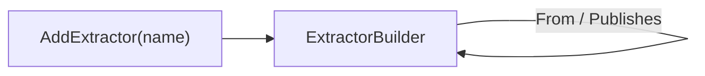

# Components

> Every component is declared through a block builder that exposes only its legal edges — illegal topology is a compile error.

## How it works


```mermaid
graph LR
    A["AddExtractor(name)"] --> C["ExtractorBuilder"]
    C -->|"From / Publishes"| C
```

Each `Add*` call on `SystemBuilder` returns the block's builder directly, whose members are exactly that block's legal edges. A method that would be illegal for the block type does not exist on its builder type, so the compiler rejects it before validation ever runs. All component builders also expose `Calls(service)` for platform-service invocations — synchronous request/response calls through the Dapr sidecar. The topology records the edges *between* components and platform services. Everything about the workload shape (hosting model, activation, ports, process lifetime) lives in the component's own scaffold — a cron schedule is deployment-owned configuration the topology deliberately does not repeat.

Underneath, every declaration is a **`Component`** — the shared substance each builder records into, mirroring `Pipeline`'s role in `intropy-framework`. Each block kind is a sealed subclass (`ExtractorComponent`, `LoaderComponent`, `TransactionalIntegrationComponent`), and the builder exposes it via its `Component` property:

```csharp
ExtractorComponent orders = s.AddExtractor("order-extractor")
    .From(Ports.OrderExtractorSource)
    .Publishes(Messages.Orders)
    .Component;                       // optional typed handle — Name, Kind
```

Holding the handle is opt-in; chains that don't need it are unchanged. The component exposes `Name` and `Kind`; the recorded edges stay internal until `Build()` materializes them into the model.

## Component kinds

Each kind exposes only its own legal edges:

| Kind | Subscribes | Publishes | Port | Services | Required |
|------|-----------|-----------|------|----------|----------|
| Extractor | — | messages | `From(port)` | `Calls(service)` | `Publishes` |
| Loader | exactly 1 message | — | `To(port)` | `Calls(service)` | `Subscribes` |
| Transactional integration | — | — | `From` / `To(port)` | `Calls(service)` | `From` and `To` |

`Subscribes`/`Publishes` are the asynchronous (message) edges; `From`/`To` are the edges out through ports; `Calls` records Dapr service app IDs the component invokes. A component may publish several distinct messages, each resolving to its own channel — a second publish resolving to a channel the component already publishes throws `InvalidOperationException` at the declaration. See [Messages](messages.md), [Ports](ports.md), and the [Model and DSL Reference](model.md).

## Declaring components

```csharp
var s = SystemBuilder.Create("order-flow");

s.AddExtractor("order-extractor")
    .From(Ports.OrderExtractorSource)
    .Publishes(Messages.Orders);
```

Component names are DNS-1123 labels, validated at the call site with an `ArgumentException` — they become Kubernetes resource names and Dapr app-ids.

## Minted identities

The names in the topology — component names, service app-ids, pubsub names, the derived binding names — are facts the topology *mints*: the local run backend materializes them, generated artifacts carry them, and deployment honors them. They are not copies of deployment configuration, so they cannot drift from it; breaking one (renaming a deployed app-id without updating the topology) fails loudly at runtime. Deployment treats these names as owned by the topology, never as values to maintain a second copy of.

One qualification: a `ServiceRef` app-id is unqualified, while Dapr service resolution in a cluster is namespace-scoped. The minted identity holds within the system's own namespace; invoking a service across namespaces would need qualified app-ids, which the model does not express today.

A second minted identity is derived rather than declared: a transactional integration's `InternalQueue` (`internal-<component>` pubsub, `hop` topic) — the queue joining its receive and send pipelines. It is workload shape, not an inter-component edge, so it never enters `SystemTopology.Topics` and the DSL exposes nothing for it. It is minted in the model so every backend materializes the same component (locally: Redis, scoped to exactly the owning integration) and the framework runner reads the names from the generated `.intropy.json` instead of a scaffold constant.

## What the compiler rejects

```csharp
s.AddLoader("l").Publishes(topic);        // loaders publish nothing
s.AddExtractor("e").Subscribes(topic);    // extractors read ports, not topics
```

Only what types cannot check — and what no single declaration line can decide — is validated at `Build()`. Invariants local to one declaration chain throw at the call site: a second `Subscribes` on one loader, a repeated `Calls` or `Publishes` channel, a handled message twice or off the subscription's channel. `Build()` validates what spans components: completeness (a required output that was never declared, a missing subscription, a topic with only one side) and cross-component conflicts. A loader needs no `To`: its destination may stay a private local component. See [Validation](validation.md).

## Related

- [Model and DSL Reference](model.md) — the complete DSL grammar and output model
- [Messages](messages.md) — the asynchronous `Subscribes` / `Publishes` edges
- [Ports](ports.md) — the `From` / `To` edges out of the system
- [Validation](validation.md) — what remains for Build-time rules
