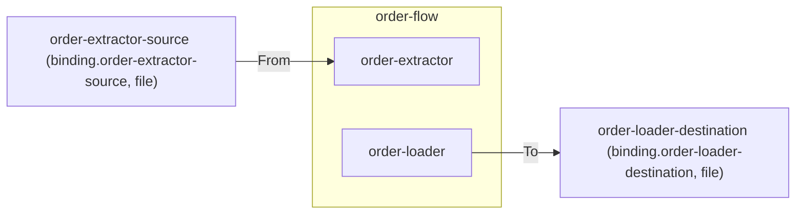

# Connectors

> A connector is the named port an edge block reaches the outside world through; it materializes as exactly one Dapr binding component whose name is derived from the connector's name.

## How it works



Every edge block reaches the outside world through a connector. All connectivity runs through Dapr — the transport selects the Dapr binding component's `spec.type`, it never bypasses Dapr. Each connector becomes exactly one Dapr binding component whose name is derived from the connector's name (`binding.<connector-name>`), never declared.

## Declaring connectors

Connectors are declared as static fields in a scaffolded `Connectors.cs`. They are system-owned and never shared across systems:

```csharp
public static class Connectors
{
    public static readonly ConnectorRef OrderExtractorSource =
        ConnectorRef.Define("order-extractor-source", Transport.File("./test/order-extractor-source"));

    public static readonly ConnectorRef OrderLoaderDestination =
        ConnectorRef.Define("order-loader-destination", Transport.File("./test/order-loader-destination"));
}
```

Direction is not part of a connector's identity — it follows from usage: `From(connector)` reads, `To(connector)` writes. One connector name declared with two different transports is rejected at `Build()` as ITP104.

## The file transport

The minimal model ships one transport:

| Transport | Dapr type |
|-----------|-----------|
| `Transport.File(rootPath)` | `bindings.localstorage` |

`Transport.File(rootPath)` reads and writes files in a folder on the host — the folder *is* the endpoint, so a file connector needs no external-system concept and the system runs with zero external configuration. It is the default resolution `intropy sys create` applies; generation absolutizes the root path relative to the SystemHost directory. Other transports (sftp/blob/http/custom) live on the `full-topology` branch.

## Materialized connectors

Each used connector folds into a `ConnectorResource` carrying the transport, the derived Dapr component name, the union of used directions, and the components using it:

```csharp
public sealed record ConnectorResource
{
    public required string Name { get; init; }
    public required Transport Transport { get; init; }
    public string DaprComponentName => $"binding.{Name}";
    public required IReadOnlyList<ConnectorDirection> Directions { get; init; }
    public required IReadOnlyList<string> UsedBy { get; init; }
}
```

## Related

- [Validation](validation.md) — ITP104, ITP401
- [ADR 0002](../decisions/0002-connector-redefinition.md) — why "connector" means the connection point
- [ADR 0009](../decisions/0009-minimal-model-for-system-tutorial.md) — the cut to the minimal model
