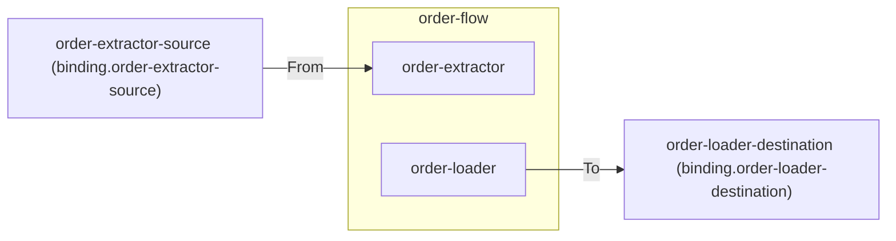

# Connectors

> A connector is the named port an edge block reaches the outside world through; it materializes as exactly one Dapr binding component whose name is derived from the connector's name.

## How it works



Every edge block reaches the outside world through a connector. All connectivity runs through Dapr — a connector never bypasses it. Each connector becomes exactly one Dapr binding component whose name is derived from the connector's name (`binding.<connector-name>`), never declared.

The name is the connector's **whole identity**. The binding's deployed `spec.type` — sftp, blob, http — together with its address and credentials, is environment-owned deployment configuration. The topology deliberately does not repeat it: a fact deployment owns and can edit would drift from a second copy declared here, and a drifting topology is an untrusted one. Locally, F5 runs substitute their own resolution through the development definition (every connector resolves to a localstorage folder), so the system runs with zero external configuration.

## Declaring connectors

Connectors are declared as static fields in a scaffolded `Connectors.cs`. They are system-owned and never shared across systems:

```csharp
public static class Connectors
{
    public static readonly ConnectorRef OrderExtractorSource =
        ConnectorRef.Define("order-extractor-source");

    public static readonly ConnectorRef OrderLoaderDestination =
        ConnectorRef.Define("order-loader-destination");
}
```

Direction is not part of a connector's identity — it follows from usage: `From(connector)` reads, `To(connector)` writes. Because the name is the identity, two declarations with the same name are the same connector by construction; there is nothing left to conflict.

## Materialized connectors

Each used connector folds into a `ConnectorResource` carrying the derived Dapr component name, the union of used directions, and the components using it:

```csharp
public sealed record ConnectorResource
{
    public required string Name { get; init; }
    public string DaprComponentName => $"binding.{Name}";
    public required IReadOnlyList<ConnectorDirection> Directions { get; init; }
    public required IReadOnlyList<string> UsedBy { get; init; }
}
```

## Related

- [Validation](validation.md) — name collisions and usage rules
