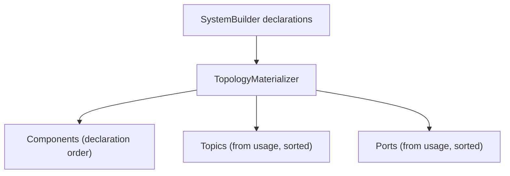

# Materialization

> Builder declarations fold into an immutable, deterministic model — components in declaration order, resources deduplicated from usage and sorted.

## How it works



`Build()` first folds the recorded declarations into the immutable `SystemTopology`. Materialization never fails — structurally broken declarations still materialize (first-seen wins on conflicts) so validation rules can inspect and report the full picture afterwards.

## The model

Everything in `Intropy.Topology.Model` is a sealed record with `required` init-only members and `IReadOnlyList<T>` collections:

```csharp
public sealed record SystemTopology
{
    public required string SystemName { get; init; }
    public required IReadOnlyList<ComponentModel> Components { get; init; }
    public required IReadOnlyList<TopicResource> Topics { get; init; }
    public required IReadOnlyList<PortResource> Ports { get; init; }
}
```

| Model | Materialized from |
|-------|-------------------|
| `ComponentModel` | Each `Add*` call, in declaration order, with its edges (`Subscribes`, `Publishes`, `Ports`) |
| `TopicResource` | Every topic published to or subscribed from, with `Publishers`/`Subscribers` precomputed |
| `PortResource` | Every port used, with the union of directions and `UsedBy` |

A `PortResource` is `{ Name, DaprComponentName, Directions, UsedBy }` — the name is the whole identity, and `DaprComponentName` repeats it (the binding takes the port name unchanged).

## Determinism

The materializer is deliberately deterministic so the serialized model is byte-stable across runs:

- Components keep declaration order.
- Topics and ports are sorted with `StringComparer.Ordinal`.
- `Publishers`, `Subscribers`, and `UsedBy` lists are sorted sets.

A byte-exact JSON snapshot test guards this — the same declaration always serializes to the same JSON, which downstream generation tooling can diff and cache.

## Serialization

The model round-trips through `System.Text.Json`:

```json
{
  "Name": "order-loader-destination",
  "DaprComponentName": "order-loader-destination",
  "Directions": [1],
  "UsedBy": ["order-loader"]
}
```

## Related

- [Validation](validation.md) — the rules that run over the materialized picture
- [Topics](topics.md) and [Ports](ports.md) — the resource models
