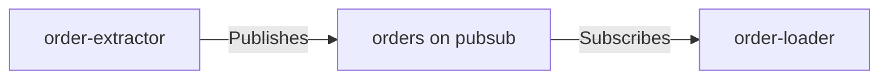

# Messages

> Messages are typed refs declared as static fields; the backing pubsub resource materializes from usage — there is no `AddTopic`.

## How it works



A `MessageRef<T>` is the asynchronous interface between components. One declaration carries three things:

- **Identity** — the message's logical name (e.g. `orders`)
- **Channel** — the Dapr pubsub component and topic it travels on; the topic name defaults to the message name
- **Contract** — the payload type `T`

Publishing (`Publishes`) or subscribing (`Subscribes`) to a message is what brings its channel — the topic and its pubsub — into the model.

A component may publish several distinct messages. Repeating one channel — a second `Publishes` resolving to the same pubsub and topic — is rejected at `Build()` as a redundant edge. The core model warns when a message has only one side — published with no subscriber, or subscribed with no publisher — so partial systems can still run locally; deployment validation can treat those warnings as errors.

## Declaring messages

Messages are declared as static fields — in a scaffolded `Messages.cs` for system-internal messages, or in a shared `Integrio.Contracts.*` package for cross-system messages:

```csharp
public static class Messages
{
    /// <summary>Order messages (pubsub 'pubsub'); the topic name defaults to the message name.</summary>
    public static readonly MessageRef<Order> Orders = MessageRef<Order>.Define("orders", "pubsub");
}
```

The message, pubsub, and topic names are DNS-1123 names, validated at `Define`. The pubsub name is minted here: local runs materialize a pubsub component with exactly this name, and deployment configuration consumes it rather than maintaining its own copy. Use the three-argument `Define` when the topic name must differ from the message name.

These names describe the *inter-component* vocabulary. The one pubsub a component never declares here is a transactional integration's internal hop — minted by the model as `internal-<component>`, never declarable via `MessageRef`, and scoped to exactly its owning component. The `internal-` prefix keeps the two namespaces disjoint.

## The contract type

The type parameter is the message's event contract. It flows into the materialized model as `ContractTypeName` (the type's full name) and pins both halves of the declaration: one message name carrying two different contract types is rejected at `Build()`, and so is one channel targeted by different contracts under different message names.

## Materialized messages and topics

At `Build()`, each used message folds into a `MessageResource` with both sides of the edge precomputed, grouped under one `MessageGroupResource` named after the system:

```csharp
public sealed record MessageResource
{
    public required string Name { get; init; }
    public required string ContractTypeName { get; init; }
    public required MessageChannel Channel { get; init; }
    public required IReadOnlyList<string> Publishers { get; init; }
    public required IReadOnlyList<string> Subscribers { get; init; }
}
```

The channel keeps materializing as a `TopicResource` alongside it — deployment consumes topics, and a message's channel is exactly one topic:

```csharp
public sealed record TopicResource
{
    public required string PubSubName { get; init; }
    public required string TopicName { get; init; }
    public required string ContractTypeName { get; init; }
    public required IReadOnlyList<string> Publishers { get; init; }
    public required IReadOnlyList<string> Subscribers { get; init; }
}
```

`Publishers` and `Subscribers` feed the generated Dapr pubsub component's `scopes`.

## Related

- [Components](components.md) — `Publishes` and `Subscribes` per block kind
- [Materialization](materialization.md) — how usage folds into resources
- [Validation](validation.md) — message completeness warnings, channel and contract conflicts, and name collisions
