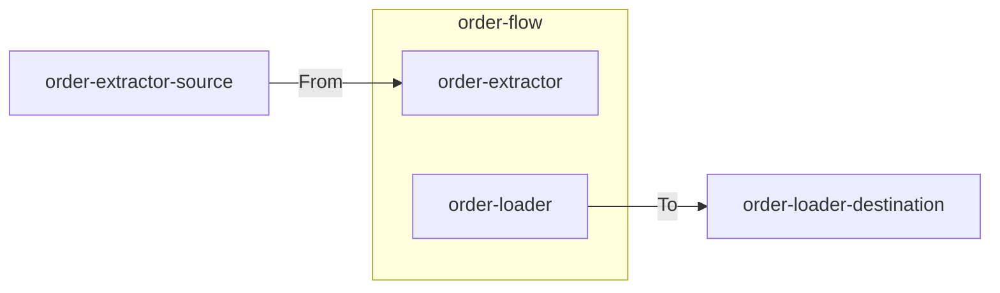

# Ports

> A port is the named port an edge block reaches the outside world through; it materializes as exactly one Dapr binding component named after the port.

## How it works



Every edge block reaches the outside world through a port. All connectivity runs through Dapr — a port never bypasses it. Each port becomes exactly one Dapr binding component carrying the port's name, never declared separately.

The name is the port's **whole identity**. The binding's deployed `spec.type` — sftp, blob, http — together with its address and credentials, is environment-owned deployment configuration. The topology deliberately does not repeat it: a fact deployment owns and can edit would drift from a second copy declared here, and a drifting topology is an untrusted one. Locally, F5 runs substitute their own resolution through the development definition (every port resolves to a localstorage folder), so the system runs with zero external configuration.

## Declaring ports

Ports are declared as static fields in a scaffolded `Ports.cs`. They are system-owned and never shared across systems:

```csharp
public static class Ports
{
    public static readonly PortRef OrderExtractorSource =
        PortRef.Define("order-extractor-source");

    public static readonly PortRef OrderLoaderDestination =
        PortRef.Define("order-loader-destination");
}
```

Direction is not part of a port's identity — it follows from usage: `From(port)` reads, `To(port)` writes. Because the name is the identity, two declarations with the same name are the same port by construction; there is nothing left to conflict.

## Materialized ports

Each used port folds into a `PortResource` carrying the Dapr component name, the union of used directions, and the components using it:

```csharp
public sealed record PortResource
{
    public required string Name { get; init; }
    public string DaprComponentName => Name;
    public required IReadOnlyList<PortDirection> Directions { get; init; }
    public required IReadOnlyList<string> UsedBy { get; init; }
}
```

## Related

- [Validation](validation.md) — name collisions and usage rules
