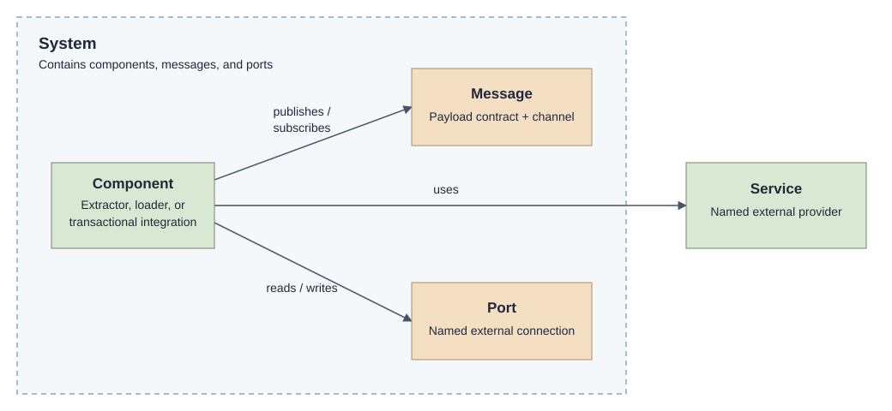

# Intropy System Model

An integration system contains components that move data between systems. The Intropy model describes those components and their connections.

The model uses five concepts:

- **Systems** group components, messages, and ports.
- **Components** read, process, and write data.
- **Messages** carry typed data between components.
- **Ports** name connections to the outside world.
- **Services** provide functionality that components invoke.

The arrows describe declared relationships, not execution order. A component's kind determines which relationships it can have.

## System

A system is a named collection of integration components and their connections. Its declaration describes the structure of the integration, independently of how it is run.

For example, an order-flow system can contain an extractor that reads orders and a loader that writes them to a destination.

## Component

A component is an integration workload with a name and a kind. It contains the processing logic; the topology describes its connections.

There are three component kinds:

| Kind | Connections |
|------|-------------|
| Extractor | Reads from optional source ports and publishes one or more messages. |
| Loader | Subscribes to one message and writes through optional destination ports. |
| Transactional integration | Reads from at least one source port and writes through at least one destination port. |

All three kinds can invoke services. A transactional integration also has an internal hand-off between receiving and sending. That hand-off is not a public message connection.

## Message

A message is a named payload contract carried over a channel. The contract describes the data; the channel identifies a messaging resource and a topic within it.

Components publish or subscribe to messages. For example, an extractor publishes order messages, and a loader subscribes to them.

The logical message and its transport topic are two views of the same connection. They are not declared separately.

## Port

A port is a named connection point to an external system. A component reads from it or writes through it. Direction follows from usage, not from the port's identity.

The topology records the name and usage, not the connection technology, address, or credentials.

For example, an order source port can have different connection settings in local development and production.

## Service

A service is a named external provider that components invoke.

For example, an extractor and a loader can both use an idempotency service. The topology records their dependency; it does not define or deploy the service.

## Configuration boundary

The topology owns component names, message contracts, channels, port names, and service dependencies. Deployment owns schedules, connection settings, credentials, replicas, and resource limits.

A system can also select a telemetry export destination. Local development declarations can map ports to folders and services to contract-backed mocks. These settings do not introduce additional components or connections into the topology.

The [Topology Declaration Language](declaration-language.md) describes what can be stated and which combinations are valid, without code examples. The [implementation reference](model.md) describes the C# syntax and runtime mappings.
