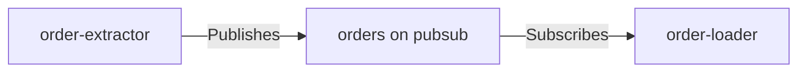

# Topics

> Topics are typed refs declared as static fields; the backing pubsub resource materializes from usage — there is no `AddTopic`.

## How it works



A `TopicRef<T>` names a topic on a Dapr pubsub component and carries the event contract type `T` at the declaration site. It is the asynchronous interface between components. Publishing to (`Publishes`) or subscribing to (`Subscribes`) a topic is what brings the topic (and its pubsub) into the model.

A component publishes at most one topic — a second `Publishes` call on the same component is rejected at `Build()`. (Multi-output components with named ports live on the `full-topology` branch.) Every topic needs both sides: a published topic nobody subscribes to is an error, and so is a subscription nothing publishes.

## Declaring topics

Topics are declared as static fields — in a scaffolded `Topics.cs` for system-internal topics, or in a shared `Integrio.Contracts.*` package for cross-system topics:

```csharp
public static class Topics
{
    /// <summary>Order messages on topic 'orders' (pubsub 'pubsub').</summary>
    public static readonly TopicRef<Order> Orders = TopicRef<Order>.Define("pubsub", "orders");
}
```

Both the pubsub name and the topic name are DNS-1123 names, validated at `Define`. The pubsub name is minted here: local runs materialize a pubsub component with exactly this name, and deployment configuration consumes it rather than maintaining its own copy.

## The contract type

The type parameter is the topic's event contract. It flows into the materialized model as `ContractTypeName` (the type's full name) and pins the topic to one contract: using the same topic with two different contract types anywhere in the system is rejected at `Build()`.

## Materialized topics

At `Build()`, each used topic folds into a `TopicResource` with both sides of the edge precomputed:

```csharp
public sealed record TopicResource
{
    public required string PubSubName { get; init; }
    public required string TopicName { get; init; }
    public required string ContractTypeName { get; init; }
    public required IReadOnlyList<string> Publishers { get; init; }
    public required IReadOnlyList<string> Subscribers { get; init; }
}
```

`Publishers` and `Subscribers` feed the generated Dapr pubsub component's `scopes`.

## Related

- [Components](components.md) — `Publishes` and `Subscribes` per block kind
- [Materialization](materialization.md) — how usage folds into resources
- [Validation](validation.md) — topic completeness, contract conflicts, and name collisions
