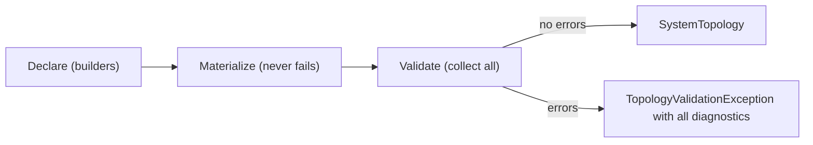

# Validation

> `Build()` collects every diagnostic in one pass and reports the whole picture at once — never just the first violation.

## How it works



Validation runs at `Build()`, after materialization. Materialization never fails — structurally broken declarations still materialize (first-seen wins on conflicts) so rules can inspect and report the full picture. Each rule produces `TopologyDiagnostic` records with a severity, a message, and the component or resource it targets.

Most illegality never reaches validation: the block builders make it uncompilable. What remains for Build-time rules is only what types cannot check — completeness and cross-component conflicts.

## The API

| Method | Behavior |
|--------|----------|
| `Build()` | Materializes and validates; throws `TopologyValidationException` when any error-severity diagnostic exists |
| `TryBuild(out topology, out diagnostics)` | Non-throwing; returns `false` with all diagnostics when invalid |
| `Validate()` | Runs all rules and returns every diagnostic (including warnings) without throwing |

`TopologyValidationException` carries the full diagnostic list and builds a multi-line message listing every violation:

```text
The system topology is invalid (2 error(s)):
  [Error] order-extractor: Extractor components must publish to at least one topic; add a Publishes call.
  [Error] orders: The topic 'orders' on pubsub 'pubsub' is subscribed to but no component publishes it.
```

## Rules

| Severity | Rule |
|----------|------|
| Error | Every component needs a unique name |
| Error | A system must declare at least one component |
| Error | A component publishes at most one topic — more than one `Publishes` call is an error |
| Error | A component must not subscribe to the same topic more than once |
| Error | One topic must not be used with two different event contract types |
| Error | Extractors must publish (a loader's destination may stay a private local component) |
| Error | Loaders subscribe to exactly one topic |
| Error | Transactional integrations must declare at least one `From` and one `To` port |
| Error | A published topic must have a subscriber |
| Error | A subscribed topic must have a publisher |
| Warning | A component with no edges (no subscriptions, publishes, or ports) is likely unfinished |
| Error | A pubsub name must not equal a port's derived Dapr component name |

## Argument validation

Name and argument invariants are enforced eagerly at the call site, not collected: component, topic, and port names are DNS-1123 labels/subdomains and throw `ArgumentException` immediately when invalid. Only *semantic* topology validation is deferred to `Build()` so all diagnostics report at once.

## Related

- [Components](components.md) — what the compiler rejects instead
- [Materialization](materialization.md) — why materialization never fails
