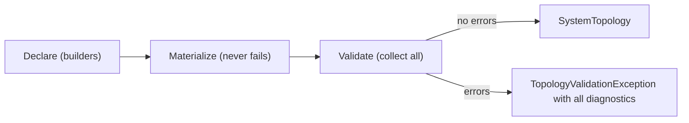

# Validation

> `Build()` collects every diagnostic in one pass and reports the whole picture at once — never just the first violation.

## How it works



Validation runs at `Build()`, after materialization. Materialization never fails — structurally broken declarations still materialize (first-seen wins on conflicts) so rules can inspect and report the full picture. Each rule produces `TopologyDiagnostic` records with a stable code, a severity, a message, and the component or resource it targets.

Most illegality never reaches validation: the block builders make it uncompilable. What remains for Build-time rules is only what types cannot check — completeness and cross-component conflicts.

## The API

| Method | Behavior |
|--------|----------|
| `Build()` | Materializes and validates; throws `TopologyValidationException` when any error-severity diagnostic exists |
| `TryBuild(out topology, out diagnostics)` | Non-throwing; returns `false` with all diagnostics when invalid |
| `Validate()` | Runs all rules and returns every diagnostic (including warnings) without throwing |

`TopologyValidationException` carries the full diagnostic list and builds a multi-line message listing every violation:

```text
The system topology is invalid (2 error(s)):
  ITP206 [Error] order-extractor: Extractor components must publish to at least one topic; add a Publishes call.
  ITP209 [Error] orders: The topic 'orders' on pubsub 'pubsub' is subscribed to but no component publishes it.
```

## Diagnostic codes

Codes are grouped in bands.

| Code | Severity | Rule |
|------|----------|------|
| ITP001 | Error | Every component needs a unique name |
| ITP002 | Error | A system must declare at least one component |
| ITP101 | Error | A component publishes at most one topic — more than one `Publishes` call is an error |
| ITP102 | Error | A component must not subscribe to the same topic more than once |
| ITP103 | Error | One topic must not be used with two different event contract types |
| ITP104 | Error | One connector name must not be declared with two different transports |
| ITP108 | Error | One service name must not be declared with two different definitions |
| ITP206 | Error | Extractors must publish (a loader's destination may stay a private local component) |
| ITP207 | Error | Loaders subscribe to exactly one topic |
| ITP208 | Error | A published topic must have a subscriber |
| ITP209 | Error | A subscribed topic must have a publisher |
| ITP210 | Error | A declared schedule must be valid five-field cron or a macro such as `@daily` |
| ITP302 | Warning | A component with no edges (no subscriptions, publishes, or connectors) is likely unfinished |
| ITP401 | Error | A pubsub name must not equal a connector's derived Dapr component name |
| ITP402 | Error | A service name must not collide with a component name or the reserved `rabbitmq` broker name |

### Retired and compile-time-enforced codes

These codes are never emitted at `Build()` and are never reused:

| Code | Status |
|------|--------|
| ITP105 | Retired with the minimal model — connector direction capabilities (input support) are not modeled; the file transport reads and writes |
| ITP106 | Retired with the minimal model — as ITP105, for output support |
| ITP107 | Retired with the minimal model — unresolved connectors no longer exist; every `ConnectorRef` carries a transport |
| ITP201 | Retired — invalid cron on the trigger-era `ScheduleTrigger`; the schedule *attribute* introduced by [ADR 0010](../decisions/0010-schedule-as-activation-attribute.md) uses ITP210 |
| ITP202 | Retired — missing trigger; triggers no longer exist |
| ITP203 | Retired — multiple `TriggeredBy`; triggers no longer exist |
| ITP204 | Enforced at compile time — an illegal edge for a block simply doesn't exist on its builder |
| ITP205 | Enforced at compile time — as above |
| ITP301 | Retired permanently — "service declared but unused" presupposed the per-component `.Uses` edge; services are system-level ([ADR 0011](../decisions/0011-system-level-platform-services.md)), so there is no usage to check. ITP402 was revived by the same ADR with its original meaning |
| ITP501 | Retired with the minimal model — APIs (`Provides`/`Consumes`) are not modeled |

The features behind ITP105/106/107/501 live on the `full-topology` branch (see [ADR 0009](../decisions/0009-minimal-model-for-system-tutorial.md)).

## Argument validation

Name and argument invariants are enforced eagerly at the call site, not collected: component, topic, and connector names are DNS-1123 labels/subdomains and throw `ArgumentException` immediately when invalid, and `WithSchedule` throws for a null/whitespace expression. Only *semantic* topology validation is deferred to `Build()` — including cron syntax (ITP210), so all diagnostics report at once.

## Related

- [Components](components.md) — what the compiler rejects instead
- [Materialization](materialization.md) — why materialization never fails
