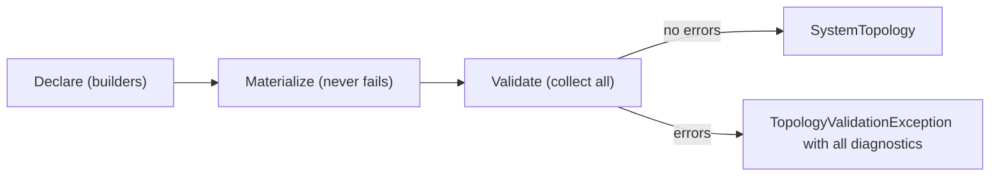

# Validation

> `Build()` collects every diagnostic in one pass and reports the whole picture at once — never just the first violation.

## How it works


```mermaid
graph LR
    D["Declare (builders)"] --> M["Materialize (never fails)"]
    M --> V["Validate (collect all)"]
    V -->|"no errors"| T["SystemTopology"]
    V -->|"errors"| X["TopologyValidationException with all diagnostics"]
```

Validation runs at `Build()`, after materialization. Materialization never fails — structurally broken declarations still materialize (first-seen wins on conflicts) so rules can inspect and report the full picture. Each rule produces `TopologyDiagnostic` records with a severity, a message, and the component or resource it targets.

Each `Add*` call on `SystemBuilder` returns the block builder, whose members are exactly that block's legal edges; invariants local to one declaration chain — a second subscription on one loader, a repeated service call or published channel, a handled message off the subscription's channel — throw `InvalidOperationException` at the offending call, with a stack trace pointing at the line. What remains for `Build()` is what spans components: completeness and cross-component conflicts.

## The API

| Method | Behavior |
|--------|----------|
| `Build()` | Materializes and validates; throws `TopologyValidationException` when any error-severity diagnostic exists |
| `TryBuild(out topology, out diagnostics)` | Non-throwing; returns `false` with all diagnostics when invalid |
| `Validate()` | Runs all rules and returns every diagnostic (including warnings) without throwing |

`TopologyValidationException` carries the full diagnostic list and builds a multi-line message listing every violation:

```text
The system topology is invalid (2 error(s)):
  [Error] order-extractor: Extractor components must publish to at least one topic; add a Publishes call.
  [Error] order-loader: Loader components must subscribe to a channel; add a Subscribes call.
```

## Declaration-time invariants

Some semantic invariants are knowable at the exact line where the mistake is made, so they throw `InvalidOperationException` at the declaration call instead of waiting for `Build()`:

| Thrown at | Invariant |
|-----------|-----------|
| `Subscribes` on a loader | A loader declares its subscription once |
| `Publishes` | A component publishes to a channel (the same pubsub and topic) at most once |
| `Calls` | A component calls a service app ID at most once |
| `Subscribes` / `AlsoHandles` | A subscription handles a message name once |
| `Subscribes` / `AlsoHandles` | Every handled message travels on the subscription's first message's channel |

## Build-time rules

| Severity | Rule |
|----------|------|
| Error | Every component needs a unique name |
| Error | A system must declare at least one component |
| Error | One message name must not resolve to two different channels |
| Error | One message name must not carry two different event contract types |
| Error | Extractors must publish (a loader's destination may stay a private local component) |
| Error | A loader subscribes to a channel (a loader that never subscribes is an error) |
| Error | Transactional integrations must declare at least one `From` and one `To` port |
| Warning | A published topic has no subscriber |
| Warning | A subscribed topic has no publisher |
| Warning | A component with no edges (no subscriptions, publishes, or ports) is likely unfinished |
| Error | A pubsub name must not equal a port's derived Dapr component name |
| Error | A service app ID must not collide with a topology component app ID |

## Argument validation

Name and argument invariants are enforced eagerly at the call site, not collected: system, component, port, and service app ID names are DNS-1123 labels; message, pubsub, and topic names are DNS-1123 subdomains; invalid values throw `ArgumentException` immediately. OTLP endpoint and header shape are also validated at the call site, as are the declaration-time invariants above. `Build()` collects every remaining diagnostic in one pass so all cross-component problems report at once.

Published topics without subscribers and subscribed topics without publishers are warnings in the core model so partially built systems can still run locally and be inspected. Deployment validation can choose to treat them as errors.

## Related

- [Model and DSL Reference](model.md) — the full DSL grammar and model shape
- [Components](components.md) — what the compiler rejects instead
- [Materialization](materialization.md) — why materialization never fails
